## 📘 Hệ thống Giao tiếp và Chia sẻ nội dung với WebTransport

> Dự án: Một hệ thống chat và chia sẻ tệp tin qua WebTransport API. Gồm một backend Go (WebTransport) và frontend web (HTML/CSS/JS) — cho phép chat thời gian thực, upload/download file theo multi-stream, và chia sẻ bản vẽ phác thảo (drawing).

---

## 🧑‍💻 THÔNG TIN NHÓM

| STT | Họ và Tên | MSSV | Email | Đóng góp |
|-----|-----------|------|-------|----------|
| 1 | Trần Đình Hào | B22DCCN278 | haotd.b22cn278@stu.ptit.edu.vn | 1. Chuẩn bị project Go, cài đặt server và client cơ bản <br> 2. Quản lý kết nối realtime, cập nhật danh sách người dùng và file <br> 3. Làm giao diện người dùng (UI/UX) |
| 2 | Bùi Ngọc Đức | B22DCCN218 | ducbn.b22cn218@stu.ptit.edu.vn | 1. Quản lý kết nối client, xử lý tin nhắn chat <br> 2. Đồng bộ danh sách người dùng online và file <br> 3. Hiển thị chat realtime, tạo chat bubbles <br> 4. Xử lý draw ở phía client |
| 3 | Nguyễn Anh Tuấn | B22DCCN758 | tuanna.b22cn758@stu.ptit.edu.vn | 1. Chia nhỏ file, upload/download nhiều luồng song song, hiển thị tiến độ <br> 2. Tạo và quản lý file tạm, hợp nhất file sau tải về <br> 3. Xác thực file, cập nhật danh sách file và hiển thị <br> 4. Thực hiện chức năng bản vẽ (drawing) phía server |

---

## 🧠 MÔ TẢ HỆ THỐNG

Hệ thống cho phép nhiều client kết nối tới server bằng WebTransport API. Chức năng chính:
- Chat thời gian thực (tin nhắn được gửi qua unidirectional stream và được phát lại trên persistent stream).
- Danh sách người online và danh sách file được gửi bằng datagrams.
- Upload file tối ưu bằng multi-stream (client chia file thành chunks, gửi song song; server ghép lại và lưu vào `uploads/`).
- Chia sẻ bản vẽ: client gửi PNG qua bidirectional stream và server chuyển tiếp/luu trữ.

**Cấu trúc logic tổng quát:**
```
client (browser)  <-->  server (Go / WebTransport)  <-->  uploads/ (file storage)
```

<!-- **Sơ đồ hệ thống:**


--- -->

## ⚙️ CÔNG NGHỆ SỬ DỤNG

| Thành phần | Công nghệ |
|:-----------|:----------|
| Backend | Go (go1.24), github.com/quic-go/quic-go, github.com/quic-go/webtransport-go |
| Frontend | Vanilla HTML/CSS/JavaScript, Bulma (CSS), Font Awesome |
| TLS / Dev cert | mkcert (localhost.pem / localhost-key.pem) |

---

## 🚀 HƯỚNG DẪN CHẠY DỰ ÁN

### 1. Bật WebTransport Developer Mode
(Google Chrome) Enable WebTransport Developer Mode
```
chrome://flags/#webtransport-developer-mode
```

### 2. Clone repository
```powershell
git clone https://github.com/jnp2018/mid-project-218278758.git
cd mid-project-218278758
```

### 3. Chạy server (dev)
Server sử dụng WebTransport API và TLS. Quy trình nhanh:

```powershell
cd source\server

# (tạo cert)
mkcert -install
mkcert localhost

# build server
go build

# Đã được build thành file .exe, tiến hành chạy
start .\source.exe
```

Lưu ý: server mặc định lắng nghe trên `:4433`.

### 4. Chạy Client

Mở giao diện chat

```powershell
cd source\client\ui
start index.html
```

### 5. Kiểm thử nhanh
- Trong giao diện, nhập tên, bấm Join Chat.
- Kiểm tra log server để thấy kết nối WebTransport và trạng thái upload/download.

---

## 🔗 GIAO TIẾP (ENDPOINT CHÍNH)

| Endpoint | Mô tả |
|:--------|:------|
| `/chat` | Endpoint WebTransport API. Client tạo: `new WebTransport('https://localhost:4433/chat?name=...')` |

Các luồng giao tiếp chính:
- Tin nhắn chat: unidirectional streams (client -> server) + persistent stream (server -> clients)
- Datagrams: thông báo online list và file list
- File transfers: bidirectional streams cho chunk uploads/downloads; server tiến hành merge chunks
- Drawing: PNG truyền theo bidirectional stream

---

## 📊 KẾT QUẢ THỰC NGHIỆM


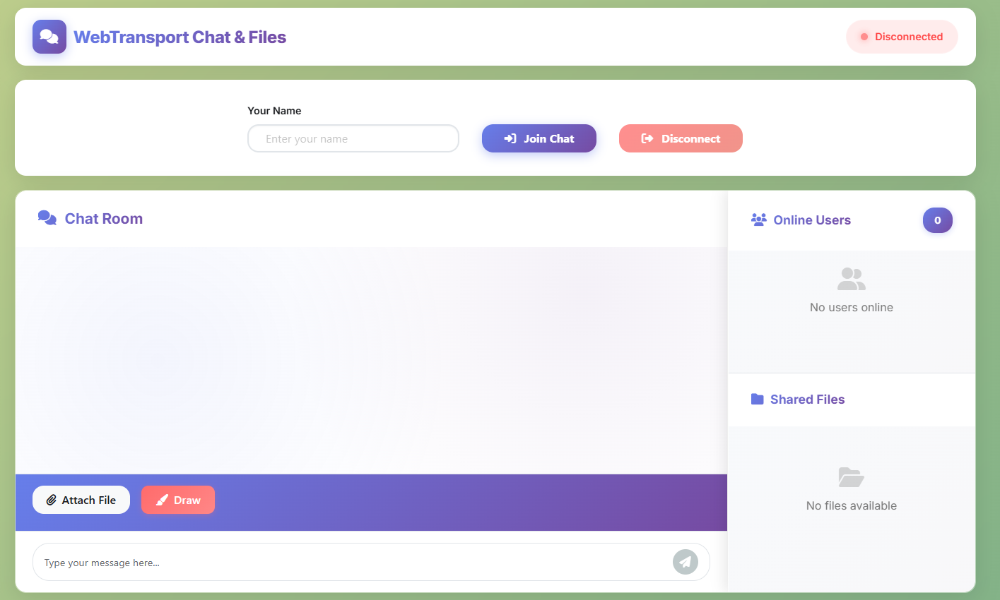

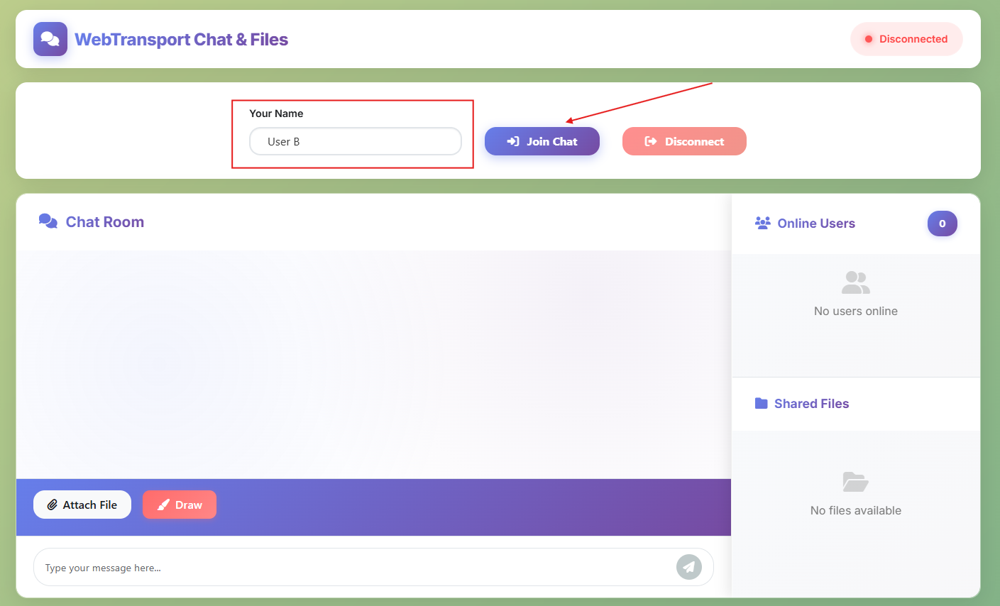

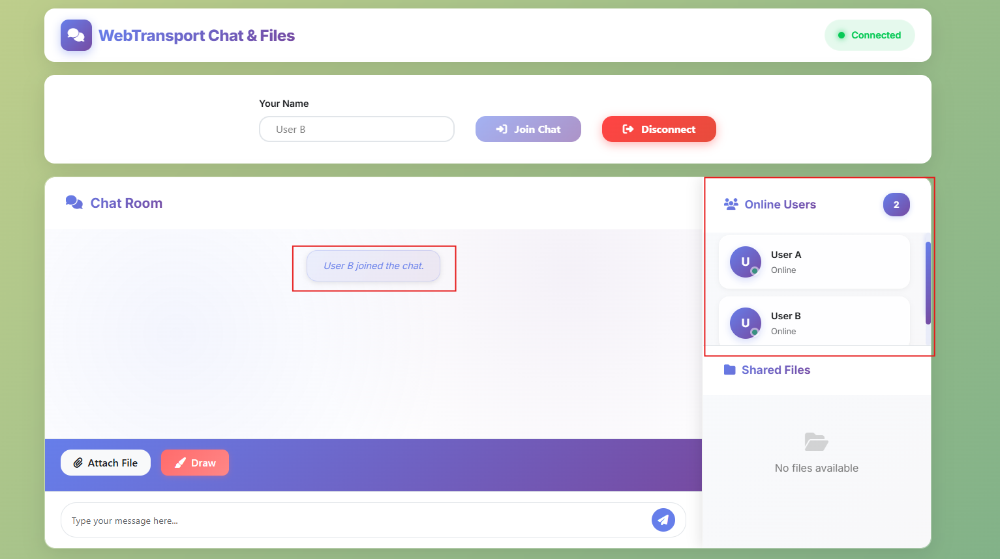

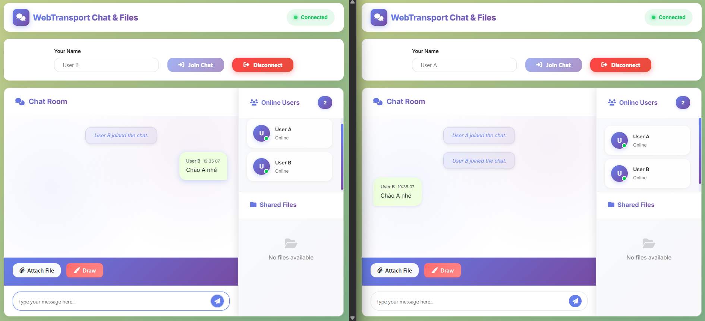

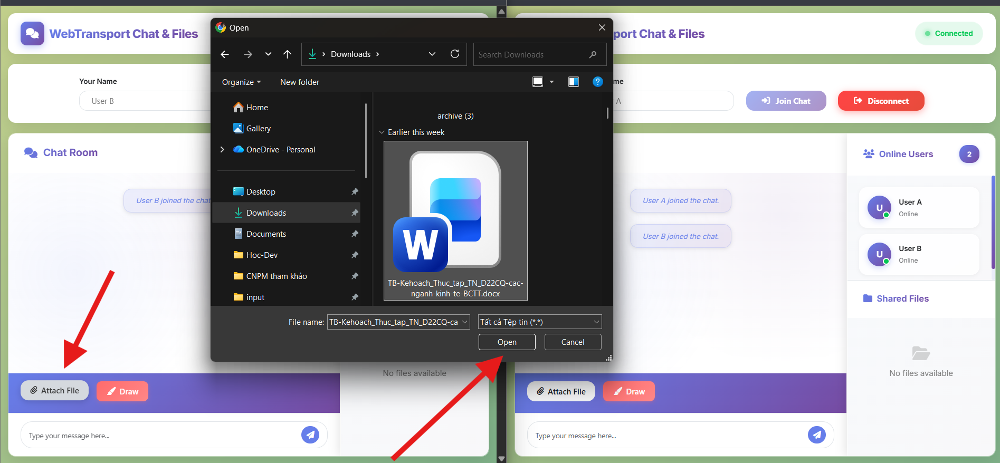

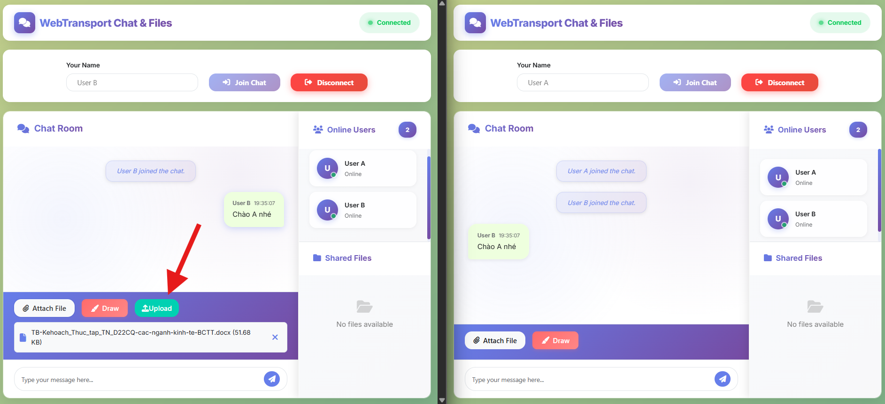

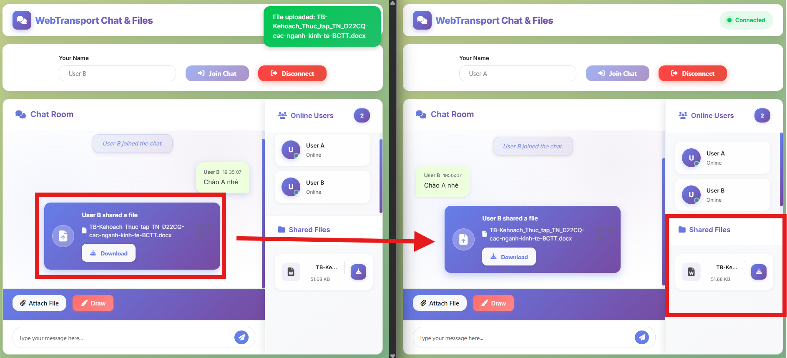

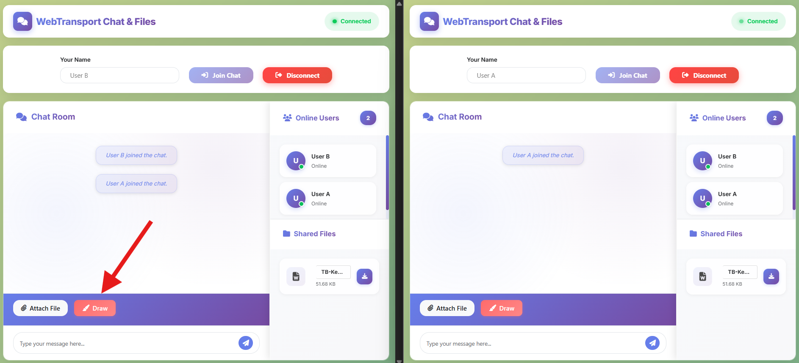

<p float="left">
  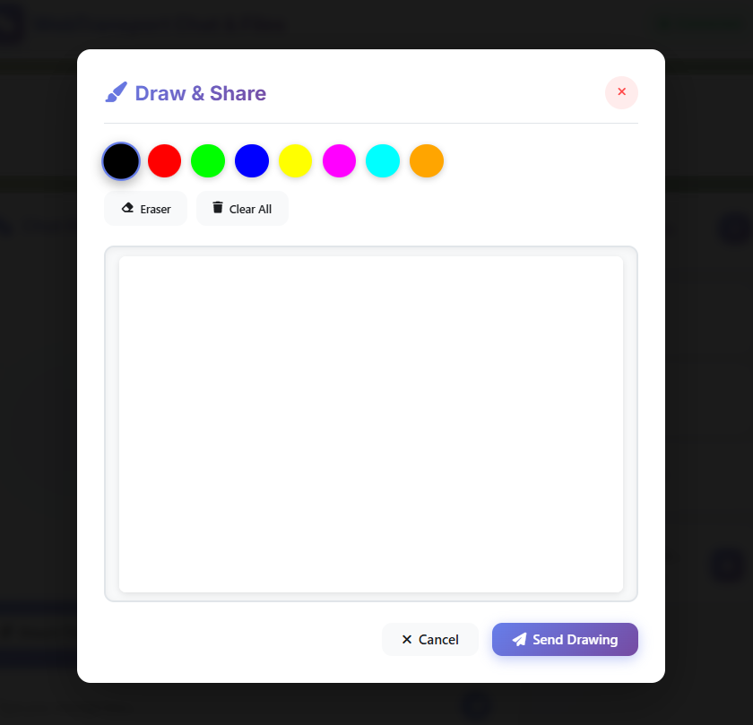
  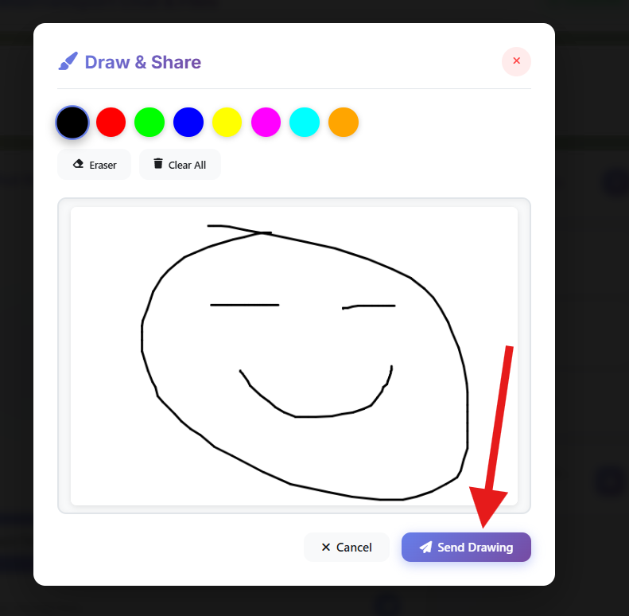
</p>

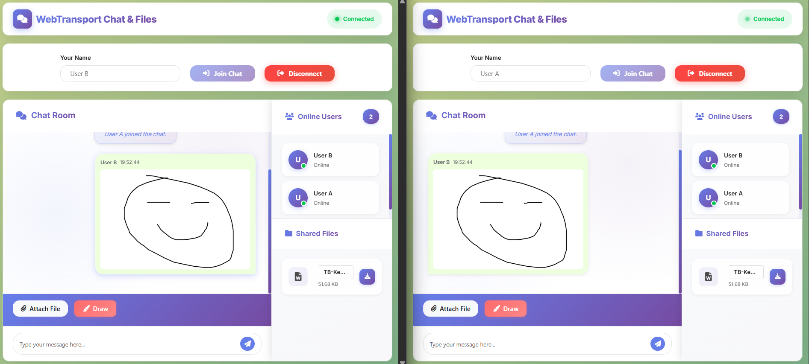

---

## 🧩 CẤU TRÚC DỰ ÁN
```
mid-project-218278758/
├── README.md                # (this file)
├── statics/                 # Chứa hình ảnh gắn vào README
│   └── ...
└── source/
    ├── .gitignore
    ├── .tool-versions
    ├── client/
    │   ├── README.md
    │   ├── connection.js
    │   ├── drawing.js
    │   ├── file.js
    │   ├── message.js
    │   ├── ui.js
    │   ├── utils.js
    │   └── ui/
    │       ├── index.html
    │       └── style.css
    └── server/
        ├── README.md
        ├── client.go
        ├── config.go
        ├── drawing_handler.go
        ├── file_handler.go
        ├── go.mod
        ├── go.sum
        ├── localhost.pem
        ├── localhost-key.pem
        ├── main.go
        ├── server.go
        ├── session_handler.go
        └── uploads/
```

---

## 🧩 HƯỚNG PHÁT TRIỂN THÊM

- [ ] Thêm xác thực người dùng và phân quyền phòng chat.
- [ ] Nâng cao hiệu năng upload/download: đo throughput và điều chỉnh NUM_STREAMS / CHUNK_SIZE.
- [ ] Thêm các tính năng khác: Thêm tính năng khảo sát, chia sẻ video

---

## 📝 GHI CHÚ

- Đảm bảo server chạy trước khi client cố kết nối.

---

## 📚 TÀI LIỆU THAM KHẢO

- Sử dụng WebTransport: https://developer.chrome.com/docs/capabilities/web-apis/webtransport?hl=vi
- Quic-Go: https://github.com/quic-go/quic-go
- webtransport-go docs: https://pkg.go.dev/github.com/quic-go/webtransport-go
- WebTransport-Go: https://github.com/quic-go/webtransport-go
